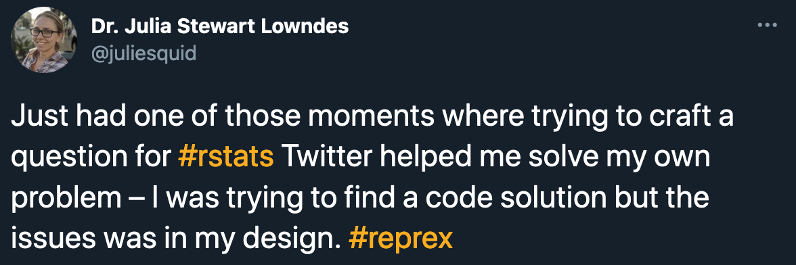

```{r setup, include=FALSE}
options(htmltools.dir.version = FALSE)

knitr::opts_chunk$set(error = TRUE, message = FALSE)

library(emo)
```

```{r xaringan-stuff, include=FALSE, warning=FALSE}
# xaringanthemer::style_mono_accent(
#   base_color = "#1381B0",
#   inverse_header_color = "#FFFFFF",
#   base_font_size = "24px"
# )

xaringanExtra::use_extra_styles(hover_code_line = TRUE, mute_unhighlighted_code = TRUE)
```

class: middle, center

## `r emo::ji("wave")`

## @sharlagelfand

---
class: middle, center

## Your code will eventually break

## You will look for help

---
class: middle, center

```{r, echo = FALSE}
knitr::include_graphics("images/xkcd.png")
```

---
class: middle, center

## You will have to ask for help

## You will have to send someone your code

---

```{r}
mtcars %>%
  filter(cyl == 6)
```

---

```{r}
library(dplyr)

mtcars %>%
  filter(cyl = 6)
```

---

```{r, echo = FALSE}
dogs <- tibble(is_cute = FALSE)
```

```{r}
library(dplyr)

# Why does this return no records?!
dogs %>%
  filter(is_cute)
```

---

```{r, echo = FALSE}
data <- tibble(date = "2021-01-02")
```

```{r, eval = FALSE}
library(dplyr)
library(ggplot2)
library(readxl)
library(tidytext)
library(janitor)
library(lubridate)

# Read data
setwd("/Users/sharla/Documents/my_work_folder/project_1/data")
data <- read_xlsx("Export 2021-01-02 V5.xlsx")

# Clean data 
data <- data %>%
  clean_names() # Make names look nice
  
# Add year
data %>%
  mutate(year = case_when(date <= "2020-12-31" & date >= "2020-01-01" ~ 2020,
                          is.na(date) ~ NA))
```

```{r, echo = FALSE}
data %>%
  mutate(year = case_when(
    date <= "2020-12-31" & date >= "2020-01-01" ~ 2020,
    is.na(date) ~ NA
  ))
```

---
class: middle, center

```{r, echo = FALSE, out.width = "80%"}

```

---
class: middle, center

```{r, echo = FALSE, out.width = "80%"}
knitr::include_graphics("images/code-photo.jpg")
```

---
class: middle, center

```{r, echo = FALSE, out.width = "80%"}
knitr::include_graphics("images/yihui-1.png")
```

---
class: middle, center

```{r, echo = FALSE, out.width = "80%"}
knitr::include_graphics("images/yihui-2.png")
```

---
class: middle, center

```{r, echo = FALSE, out.width = "80%"}

```


---
class: middle, center, inverse

# "Reproducible example"

---
class: middle, inverse

### "If you need help getting unstuck, the first step is to create a reprex, or reproducible example. The goal of a reprex is to package your problematic code in such a way that other people can run it and feel your pain. Then, hopefully, they can provide a solution and put you out of your misery."

https://www.tidyverse.org/help/

---
class: middle, inverse

### "If you need help getting unstuck, the first step is to create a reprex, or reproducible example. The goal of a reprex is to package your problematic code in such a way that other people can run it and feel your pain. Then, hopefully, <mark>they can provide a solution and put you out of your misery.</mark>"

https://www.tidyverse.org/help/

---
class: middle, inverse

### "If you need help getting unstuck, the first step is to create a reprex, or reproducible example. The goal of a reprex is to package your problematic code in such a way that <mark>other people can run it and feel your pain</mark>. Then, hopefully, they can provide a solution and put you out of your misery."

https://www.tidyverse.org/help/

---
class: middle, center

# "Other people can run it"

---
class: middle, center

```{r, echo = FALSE, out.width = "80%"}

```

---
class: middle, center

```{r, echo = FALSE, out.width = "80%"}
knitr::include_graphics("images/run-a-screenshot.png")
```

---
class: middle, center

## `r structure("\U261D", class = "emoji")` Libraries

## `r structure("\U270C", class = "emoji")` Code

## `r structure("\U1F44C", class = "emoji")` Data

---
```{r, echo = FALSE}
data <- tibble(date = "2021-01-02")
```

```{r, eval = FALSE}
library(dplyr) #<<
library(ggplot2)
library(OpenStreetMap)
library(readxl) #<<
library(tidytext)
library(janitor)

# Read data
setwd("/Users/sharla/Documents/my_work_folder/project_1/data") #<<
data <- read_xlsx("Export 2021-01-02 V5.xlsx") #<<

# Clean data 
data <- data %>%
  clean_names() # Make names look nice
  
# Add year
data %>% #<<
  mutate(year = case_when(date <= "2020-12-31" & date >= "2020-01-01" ~ 2020, #<<
                          is.na(date) ~ NA)) #<<
```
---

```{r, eval = FALSE}
library(dplyr)
library(readxl)

setwd("/Users/sharla/Documents/my_work_folder/project_1/data")
data <- read_xlsx("Export 2021-01-02 V5.xlsx")

data %>%
  mutate(year = case_when(date <= "2020-12-31" & date >= "2020-01-01" ~ 2020,
                          is.na(date) ~ NA))
```

---

```{r, eval = FALSE}
library(dplyr)
library(readxl)

setwd("/Users/sharla/Documents/my_work_folder/project_1/data") #<<
data <- read_xlsx("Export 2021-01-02 V5.xlsx") #<<

data %>%
  mutate(year = case_when(date <= "2020-12-31" & date >= "2020-01-01" ~ 2020,
                          is.na(date) ~ NA))
```

---
class: middle

```{r, echo = FALSE}

```

---

```{r}
dput(head(mtcars))
```

---

.pull-left[
```{r}
library(dplyr)

tibble(x = c(1, 2), y = c(2, 4))

tribble(
  ~x, ~y,
  1, 2, 
  2, 4
)
```
]

--

.pull-right[
```{r, echo = FALSE}
knitr::include_graphics("images/tribble.jpg")
```
]

---

```{r}
library(dplyr)

tibble(date = "2020-01-01") %>% #<<
  mutate(year = case_when(
    date <= "2020-12-31" & date >= "2020-01-01" ~ 2020,
    is.na(date) ~ NA
  ))
```

---
class: middle, center

# "and feel your pain"

---
class: center

# `reprex` package

.pull-left[
### `r structure("\U1FA90", class = "emoji")` isolated

### `r structure("\U1F91D", class = "emoji")` code + output

### `r structure("\U1F3E6", class = "emoji")` different venues

### `r structure("\U1F5BC", class = "emoji")` images
]

.pull-right[
```{r, echo = FALSE, out.width = "60%"}
knitr::include_graphics("images/reprex.svg")
```
]

---
class: center, middle, inverse

### let's live code nothing can go wrong

### for later: LINK TODO

---
class: middle, center

## you might not even need to ask for help

```{r, echo = FALSE, out.width = "80%"}
knitr::include_graphics("images/stephen-turner.png")
```

---
class: middle, center

```{r, echo = FALSE, out.width = "80%"}
knitr::include_graphics("images/shel-kariuki.png")
```

---
class: middle, center

```{r, echo = FALSE, out.width = "80%"}
knitr::include_graphics("images/rika-gorn.png")
```

---
class: middle, center

```{r, echo = FALSE, out.width = "80%"}

```

---
class: middle, center

```{r, echo = FALSE, out.width = "80%", fig.cap = "Shannon Pileggi for @WeAreRLadies"}

```


---
class: middle, center

```{r, fig.cap = "Artwork by @allison_horst", echo = FALSE, out.width = "70%"}
knitr::include_graphics("images/reprex.png")
```
